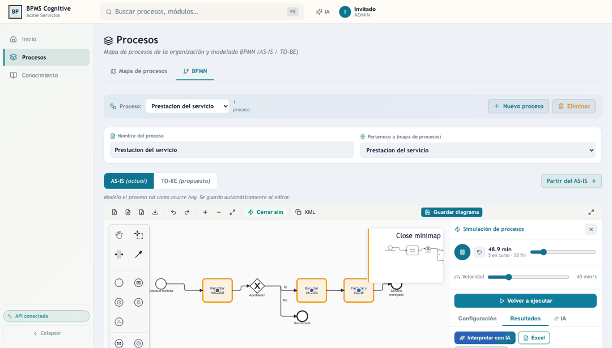
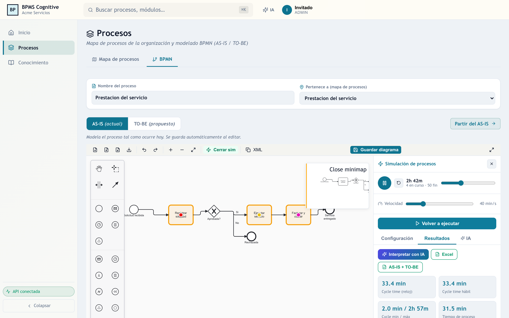
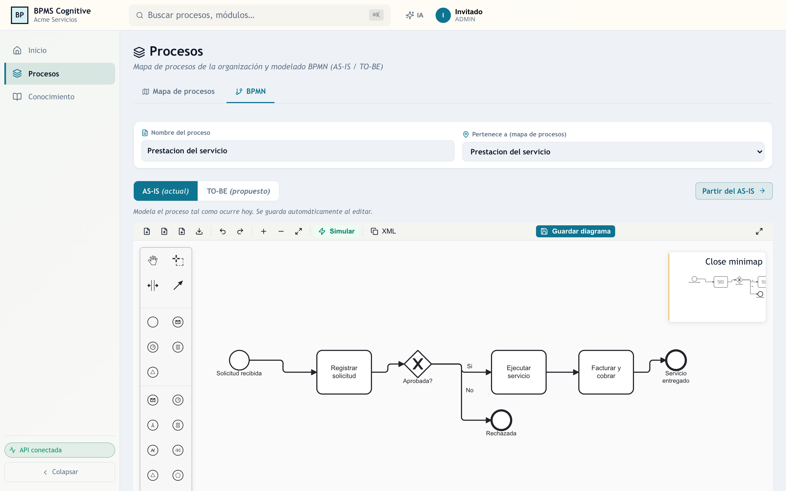
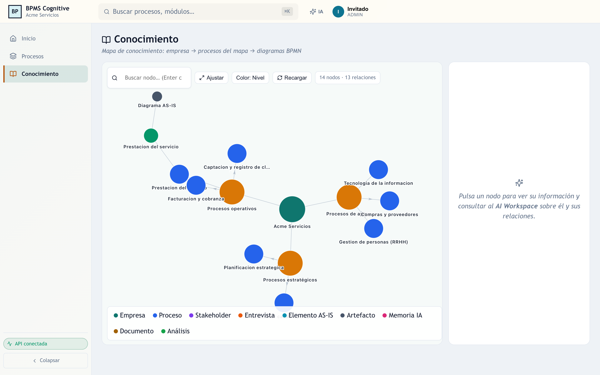
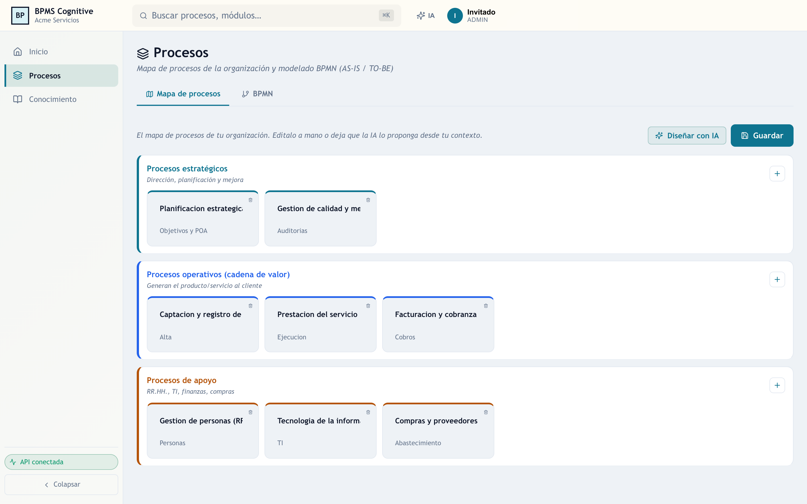

# 🧠 Agente BPMS — Copiloto Cognitivo de Procesos

Plataforma web para **gestión de procesos de negocio (BPM)** asistida por IA: mapa de
procesos, modelado **BPMN 2.0 (AS-IS / TO-BE)**, un **simulador visual de procesos**
propio (motor de eventos discretos) y un **asistente de IA** que ayuda al analista a
configurar, interpretar y mejorar sus procesos.

> **Stack:** FastAPI + SQLAlchemy (backend) · React + Vite + TypeScript (frontend) · SQLite por defecto.

---

## ✨ Características

- **Mapa de procesos** ISO-9001 (estratégicos / operativos / apoyo), editable y diseñable con IA.
- **Editor BPMN 2.0** propio (paleta completa, minimapa, colores) para **AS-IS** y **TO-BE**,
  con nombre del proceso y ubicación dentro del mapa.
- **Simulador de procesos visual** integrado en el diagrama:
  - Tokens que **recorren las líneas** como una carrera, con tareas activas resaltadas.
  - Motor de **eventos discretos (DES)** con KPIs: cycle time (reloj y hábil), espera,
    eficiencia, throughput, costo, utilización de recursos y cuellos de botella.
  - **7 distribuciones**, unidades de tiempo, **recursos con horarios/calendarios**,
    costos fijos, umbrales y **eventos de borde** (boundary events). Sin límite de corridas.
  - Edición **por elemento** haciendo clic en el diagrama.
  - **Exportación a Excel** de los resultados (escenario actual o **AS-IS + TO-BE con hoja de comparación**).
- **AI Workspace**: asistente experto que **lee el diagrama**, ayuda a **llenar los datos**,
  **interpreta resultados**, **compara AS-IS vs TO-BE** y recomienda **metodología de mejora**
  (Lean, Six Sigma/DMAIC, Teoría de Restricciones, BPR, automatización).

> 📘 ¿Dudas con la simulación? Consulta el **[Manual del Simulador](MANUAL_SIMULACION.md)** —
> explica todas las opciones (recursos, horarios, distribuciones, costos…) y cuándo llenar cada una.

---

## 📸 Capturas

**🎬 Simulación en acción** — los *tokens* recorren el proceso en tiempo real mientras se calculan los KPIs:



**Simulación visual** — KPIs (cycle time, espera, costo, cuellos de botella), con asistente de IA y exportación a Excel:



**Editor BPMN 2.0 (AS-IS / TO-BE)** — con nombre del proceso y su ubicación en el mapa:



**Mapa de conocimiento** — la organización conectada: empresa → mapa de procesos → diagramas BPMN:



**Mapa de procesos** (ISO-9001: estratégicos / operativos / apoyo):



---

## 📦 Requisitos previos

| Herramienta | Versión | Para qué |
|---|---|---|
| **Python** | 3.11 o superior | Backend (FastAPI) |
| **Node.js** | 18 o superior | Frontend (Vite/React) |
| **Git** | cualquiera | Clonar el repositorio |

Comprueba que los tienes:

```bash
python3 --version    # >= 3.11
node --version       # >= 18
git --version
```

---

## 🚀 Instalación y ejecución

> **Cómo funciona:** la aplicación son **dos servidores que corren a la vez**:
> el **backend** (API en Python/FastAPI, puerto **8010**) y el **frontend** (interfaz en
> React, puerto **5173**). El frontend consume la API del backend, así que **ambos deben
> estar encendidos** al mismo tiempo. Abre la app en el frontend (5173).

### Opción A — Automática (un solo comando) ⭐ recomendada

Levanta backend **y** frontend automáticamente (crea el entorno virtual, instala
dependencias y copia los `.env.example → .env`):

**Mac / Linux:**
```bash
git clone <URL-DE-TU-REPO>.git
cd agente-IA-prueba-master
bash scripts/start-dev.sh        # Ctrl+C para detener
```

**Windows** (doble clic en `scripts\start-dev.bat`, o desde `cmd`):
```bat
git clone <URL-DE-TU-REPO>.git
cd agente-IA-prueba-master
scripts\start-dev.bat
```
> En Windows se abren **dos ventanas** (backend y frontend); ciérralas para detener.
> *(Requiere tener Python y Node en el PATH. También puedes usar la Opción B manual.)*

### Opción B — Manual (cualquier sistema, incl. Windows)

Necesitas **dos terminales abiertas a la vez** (una por servidor):

**Terminal 1 — Backend (API, puerto 8010):**

```bash
cd backend
python3 -m venv venv               # crea el entorno virtual (una sola vez)
source venv/bin/activate           # Windows: venv\Scripts\activate
pip install -r requirements.txt    # instala dependencias (una sola vez)
cp .env.example .env               # Windows: copy .env.example .env
uvicorn app.main:app --reload --port 8010
```

**Terminal 2 — Frontend (interfaz, puerto 5173):**

```bash
cd frontend
npm install                        # instala dependencias (una sola vez)
cp .env.example .env               # Windows: copy .env.example .env
npm run dev
```

Deja **ambas terminales abiertas**. Para detener cada servidor: `Ctrl + C`.

### Abrir la aplicación

| Servicio | URL | Para qué |
|---|---|---|
| **Aplicación (UI)** | <http://127.0.0.1:5173> | Aquí trabajas |
| **API + documentación** | <http://127.0.0.1:8010/api/docs> | API interactiva (Swagger) |

### ⚙️ Conexión frontend ↔ backend

El frontend sabe dónde está el backend por la variable `VITE_API_BASE_URL` en `frontend/.env`
(por defecto `http://127.0.0.1:8010`). Si cambias el puerto del backend, actualiza también ese valor.

### 🛠️ Problemas comunes

| Síntoma | Solución |
|---|---|
| El frontend dice **"no se conecta con el backend"** | Verifica que el backend (terminal 1) esté corriendo y que `VITE_API_BASE_URL` en `frontend/.env` apunte a `http://127.0.0.1:8010`. Reinicia `npm run dev` tras cambiar el `.env`. |
| `command not found: python3` / `node` | Falta instalar Python 3.11+ o Node 18+ (ver Requisitos previos). |
| Puerto **8010 / 5173 ocupado** | Cierra el proceso que lo usa o cambia el puerto (y actualiza `VITE_API_BASE_URL`). |
| El asistente IA responde genérico | Estás en modo demo (`USE_MOCK_LLM=true`). Configura una API key y pon `USE_MOCK_LLM=false` (ver abajo). |

> **Modo demo sin IA:** por defecto `USE_MOCK_LLM=true` en `backend/.env` → la app funciona
> sin consumir cuota de IA (respuestas simuladas). Para respuestas reales del asistente,
> pon `USE_MOCK_LLM=false` y configura **al menos una** clave (ver abajo).

---

## 🔑 Configurar las API keys de los LLM

El asistente de IA funciona con **varios proveedores** y un **router con fallback automático**:
usa el que tengas configurado y, si uno falla o se queda sin cuota, **salta al siguiente solo**.
No necesitas todos — **con uno basta**.

### Cómo configurarlas

1. Copia la plantilla: `cp backend/.env.example backend/.env`
2. Edita `backend/.env`, pon `USE_MOCK_LLM=false` y rellena la(s) clave(s) que quieras:

```bash
USE_MOCK_LLM=false
GEMINI_API_KEY=tu_clave_aqui      # Google AI Studio
GROQ_API_KEY=tu_clave_aqui        # Groq
DEEPSEEK_API_KEY=tu_clave_aqui    # Deepseek
```
3. **Reinicia el backend** para que tome los cambios.

### Proveedores soportados

| Proveedor | Variable | Dónde obtener la clave | Costo |
|---|---|---|---|
| **Google Gemini** (recomendado) | `GEMINI_API_KEY` | <https://aistudio.google.com> | Gratis (cuota generosa) |
| **Groq** (muy rápido) | `GROQ_API_KEY` | <https://console.groq.com> | Gratis |
| **Deepseek** | `DEEPSEEK_API_KEY` | <https://platform.deepseek.com> | De pago |
| **Ollama** (local/offline) | *(sin clave)* | <https://ollama.com> | Gratis, corre en tu PC |

### Preguntas frecuentes

- **¿Tengo que poner todas?** No. Con **una sola** ya funciona. El sistema usa lo que tengas.
- **¿Cuál me conviene?** **Gemini** (gratis y capaz) y/o **Groq** (gratis y muy rápido). Lo ideal
  es poner **las dos**: si una se queda sin cuota, el router cae a la otra automáticamente.
- **¿Si no pongo ninguna?** Deja `USE_MOCK_LLM=true` y la app corre en **modo demo** (respuestas
  simuladas, sin IA real) — perfecto para probar la interfaz sin claves.
- **¿Y si quiero usar otro modelo?**
  - **Local/offline (sin nube ni claves):** instala [Ollama](https://ollama.com), descarga un
    modelo (`ollama pull llama3.2`) y ajusta las variables `OLLAMA_*` del `.env`. Todo corre en tu máquina.
  - **Otro proveedor en la nube no listado** (p. ej. OpenAI): no está integrado por defecto; requiere
    añadir un pequeño adaptador en `backend/app/services/llm_client_service.py`.

> **Orden de preferencia/fallback** del router: Gemini Flash → Groq → Gemini Pro → Deepseek/Ollama.
> Los proveedores sin clave simplemente se omiten.

> ⚠️ **Nunca subas tus claves a GitHub.** Van en `backend/.env`, que ya está excluido por `.gitignore`.

---

## 📖 Guía de uso del programa

> La aplicación es de **acceso libre**: no requiere usuario ni contraseña. El menú está a la izquierda.

### 1. Inicio — contexto de la organización
Define misión, visión, valores, cadena de valor, objetivos y KPIs. Este contexto alimenta
al asistente de IA y al diseño automático del mapa de procesos.

### 2. Procesos → Mapa de procesos
Crea el mapa en tres bandas (**estratégicos / operativos / apoyo**). Pulsa **+** para añadir
procesos, o **«Diseñar con IA»** para proponerlo desde tu cadena de valor. Pulsa **Guardar**.

### 3. Procesos → BPMN (AS-IS / TO-BE)
1. Escribe el **Nombre del proceso** y elige a qué proceso del mapa **pertenece**.
2. Cambia entre **AS-IS** (actual) y **TO-BE** (propuesto). Usa *«Partir del AS-IS»* para
   copiar el actual como base del mejorado.
3. **Modela** arrastrando elementos desde la paleta (tareas, compuertas, eventos, flujos).
4. Pulsa **Guardar diagrama** (también se autoguarda al editar).

### 4. Simular el proceso
1. En el editor BPMN pulsa **Simular** (icono ⚡).
2. **Haz clic en cada elemento** del diagrama (tarea, compuerta, evento) para editar sus datos:
   duración y distribución, recurso, probabilidad de las ramas, duración de los eventos de borde, etc.
3. Configura el **Escenario** (nº de instancias, llegadas, moneda, fecha), los **Recursos** y los **Horarios**.
4. Pulsa **Ejecutar simulación**: verás los **tokens recorriendo el diagrama** y, en
   **Resultados**, los KPIs (cycle time, espera, costo, utilización, cuellos de botella).

### 5. Asistente de IA de la simulación
Dentro del panel de simulación, pestaña **IA**:
- **«Ayúdame a llenar los datos»** — explica cada parámetro y sugiere valores leyendo tu diagrama.
- **«Interpretar resultados»** — analiza los KPIs y dice qué mejorar.
- **«¿Qué metodología de mejora usar?»** — recomienda Lean / Six Sigma / TOC / BPR / automatización.
- **«Comparar AS-IS vs TO-BE»** — compara ambos escenarios (ejecuta los dos antes).

### 6. AI Workspace (chat experto)
El botón **IA** (arriba a la derecha) abre un consultor experto contextualizado al módulo activo.

### 7. Conocimiento
Mapa de conocimiento de los nodos (procesos, documentos y relaciones).

---

## 🗂️ Estructura del proyecto

```
backend/    FastAPI + SQLAlchemy (API, simulación, agentes de IA)
frontend/   React + Vite + TypeScript (UI, editor BPMN, simulador visual)
scripts/    Scripts de arranque (dev / backend / frontend)
```

---

## 🔐 Seguridad

- Las claves de API viven en `backend/.env`, **excluido por `.gitignore`** (nunca se publica).
- Usa `backend/.env.example` como plantilla. Nunca subas claves reales al repositorio.

---

## 📄 Licencia

MIT — úsalo, modifícalo y compártelo libremente.
