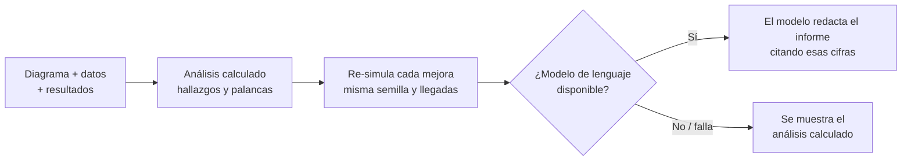

# 🧠 BPMN Simulador — Copiloto de procesos con IA

Aplicación web para **modelar, simular y mejorar procesos de negocio**. Dibujas el proceso
actual (**AS-IS**) en BPMN 2.0, le das datos reales —llegadas, duraciones, personas,
horarios o turnos, costos—, el simulador lo ejecuta cientos de veces y un **asistente de IA**
interpreta los resultados, propone el proceso mejorado (**TO-BE**) y, cuando lo simulas,
emite el **veredicto**: ¿vale la pena implementarlo?


> 📘 **[Manual de usuario](docs/MANUAL.md)** — todas las pestañas con capturas, cómo introducir
> los datos del simulador paso a paso, cómo interpretar los resultados con la IA y cómo se
> calcula cada indicador.

---

## ✨ Qué incluye

| Módulo | Para qué sirve |
|---|---|
| **Inicio · Organización** | Misión, visión, valores, estrategias, objetivos, KPIs y POA: el contexto que usa la IA. |
| **Procesos · Mapa** | Procesos estratégicos, operativos y de apoyo, con los diagramas BPMN que cuelgan de cada uno. |
| **Procesos · BPMN** | Editor BPMN 2.0 con AS-IS y TO-BE por proceso, importación/exportación `.bpmn` y guardado en el servidor. |
| **Simulador** | Motor de eventos discretos: 7 distribuciones, recursos con horario laboral o **turnos 24/7 con dotación variable**, costos, compuertas, esperas, eventos de borde, animación de tokens y exportación a Excel. |
| **IA del simulador** | Ayuda a llenar los datos, diagnostica el AS-IS midiendo cada mejora con re-simulaciones, propone el TO-BE y compara AS-IS vs TO-BE. **Funciona también sin API key** (análisis calculado). |
| **AI Workspace** | Consultor experto del módulo activo (estrategia, procesos o conocimiento). |
| **Conocimiento** | Grafo organización → procesos → diagramas, con preguntas sobre cada nodo. |

**Cálculos probados.** Cada regla del motor —llegadas, colas, horarios, turnos, costos y
utilización— está cubierta por tests automáticos con escenarios deterministas cuyo resultado se
conoce de antemano. Las fórmulas están en el [manual](docs/MANUAL.md#calculos).

---

## 📦 Requisitos

| Herramienta | Versión | Para qué |
|---|---|---|
| **Python** | 3.11 o superior | Backend (FastAPI) |
| **Node.js** | 20.19+ o 22.12+ | Frontend (Vite 8 + React) |
| **Git** | cualquiera | Clonar el repositorio |

```bash
python --version   # o python3 --version
node --version
```

---

## 🚀 Instalación

La aplicación son **dos servidores a la vez**: el **backend** (API en Python, puerto **8010**)
y el **frontend** (interfaz, puerto **5173**). Ábrela siempre desde el frontend.

### Opción A — Un solo comando (recomendada)

Crea el entorno virtual, instala las dependencias y copia los `.env.example` → `.env` la
primera vez.

```bash
git clone https://github.com/<tu-usuario>/BPMN-Simulador.git
cd BPMN-Simulador
```

| Sistema | Comando | Cómo se detiene |
|---|---|---|
| **Windows** | doble clic en `scripts\start-dev.bat` (o ejecútalo desde `cmd`) | cierra las dos ventanas que abre |
| **Mac / Linux** | `bash scripts/start-dev.sh` | `Ctrl + C` |

¿Solo uno de los dos? `scripts/start-backend.*` y `scripts/start-frontend.*`.

### Opción B — Manual (dos terminales)

**Terminal 1 — backend**

```bash
cd backend
python -m venv venv
# Windows: venv\Scripts\activate      Mac/Linux: source venv/bin/activate
pip install -r requirements.txt
cp .env.example .env                  # Windows: copy .env.example .env
uvicorn app.main:app --reload --port 8010
```

**Terminal 2 — frontend**

```bash
cd frontend
npm install
cp .env.example .env                  # Windows: copy .env.example .env
npm run dev
```

> `requirements.txt` trae solo lo necesario. `requirements-optional.txt` (PostgreSQL, Qdrant,
> OpenTelemetry) solo hace falta si activas esas opciones en el `.env`.

### Abrir la aplicación

| Qué | URL |
|---|---|
| **Aplicación** | <http://127.0.0.1:5173> |
| Documentación de la API (Swagger) | <http://127.0.0.1:8010/api/v1/docs> |
| Estado del backend y de la IA | <http://127.0.0.1:8010/api/v1/health> |

La primera vez se crea sola la organización «Mi organización» con un «Proceso 1» vacío. Para
probar con el ejemplo del manual, importa en la pestaña **BPMN** los diagramas de
[docs/ejemplos](docs/ejemplos): `credito-asis.bpmn` en AS-IS y `credito-tobe.bpmn` en TO-BE
([paso a paso](docs/MANUAL.md#5-procesos--bpmn-as-is--to-be)).

---

## 🤖 Configurar la IA

**Sin ninguna clave la aplicación funciona**: el simulador muestra su **análisis calculado**
(diagnóstico, propuesta y veredicto con cifras re-simuladas) y el AI Workspace responde en
**modo demo**. Con una clave, un modelo de lenguaje redacta esas respuestas citando las cifras
del simulador.

### 1. Consigue una clave (con una basta)

| Proveedor | Dónde | Costo |
|---|---|---|
| **Google Gemini** (recomendado) | <https://aistudio.google.com/apikey> → *Create API key* | Gratis |
| **Groq** (muy rápido) | <https://console.groq.com/keys> | Gratis |
| Deepseek | <https://platform.deepseek.com> | De pago |
| Ollama (local, sin nube) | <https://ollama.com> | Gratis, corre en tu PC |

### 2. Ponla en `backend/.env`

```dotenv
GEMINI_API_KEY=tu_clave_de_google
GROQ_API_KEY=                          # opcional: si Gemini se queda sin cuota, responde Groq
```

### 3. Reinicia el backend y compruébalo

Abre <http://127.0.0.1:8010/api/v1/health>: `"mock_mode": false` significa que la IA real está
activa. En el simulador, las respuestas de la pestaña **IA** dejan de llevar la etiqueta
«Calculado por el simulador» y el AI Workspace muestra el proveedor y el modelo que respondió.

### Variables disponibles

| Variable | Por defecto | Qué hace |
|---|---|---|
| `GEMINI_API_KEY` | vacía | Clave de Google AI Studio |
| `GEMINI_FLASH_MODEL` | `gemini-2.5-flash` | Modelo que responde las consultas |
| `GEMINI_MODEL` | `gemini-pro-latest` | Modelo Pro para tareas pesadas; las claves gratuitas no tienen cuota Pro y se responde con Flash |
| `GROQ_API_KEY` · `GROQ_MODEL` | vacía · `meta-llama/llama-4-scout-17b-16e-instruct` | Groq |
| `DEEPSEEK_API_KEY` · `DEEPSEEK_MODEL` | vacía · `deepseek-chat` | Deepseek |
| `OLLAMA_BASE_URL` · `OLLAMA_*_MODEL` | `http://127.0.0.1:11434` | Modelos locales |
| `USE_MOCK_LLM` | automático | `true` fuerza el modo demo aunque haya claves; `false` lo impide |

### Qué modelo responde

- Las consultas del asistente van a **Groq** si tiene clave y, si no, a **Gemini Flash**.
- Si ese proveedor falla, se prueba el siguiente **que tenga clave**, en este orden:
  Gemini Flash → Groq → Gemini Pro → Ollama local → Deepseek (hasta 3 intentos).
- Un proveedor que devuelve «demasiadas peticiones» se aparta 90 s; uno sin cuota o saldo, 15 min.
- Si ninguno responde, el simulador muestra igualmente su análisis calculado junto con el
  motivo, y el AI Workspace ofrece **Reintentar**.

> ⚠️ **Nunca subas `backend/.env` a GitHub** (ya está en `.gitignore`). Si alguna vez publicaste
> una clave, revócala en la consola del proveedor y crea otra.

---

## 🧩 Cómo funcionan los agentes de IA

### 1. Asistente del simulador (pestaña **IA**)

No le pide al modelo que invente: primero **calcula** y después le pide que **redacte**.


```mermaid
flowchart LR
  A[Diagrama + datos<br/>+ resultados] --> B[Análisis calculado<br/>hallazgos y palancas]
  B --> C[Re-simula cada mejora<br/>misma semilla y llegadas]
  C --> D{¿Modelo de lenguaje<br/>disponible?}
  D -- Sí --> E[El modelo redacta el informe<br/>citando esas cifras]
  D -- No / falla --> F[Se muestra el<br/>análisis calculado]
```

1. **Hallazgos**: eficiencia de flujo, esperas fijas, tiempo fuera de horario, retrabajo,
   recursos saturados, colas, trabajo manual y concentración del costo.
2. **Palancas**: eliminar el retrabajo, quitar la espera, automatizar la tarea manual y reforzar
   el recurso saturado (una persona más, o una más **por turno**). Cada una se mide
   **re-simulando** el escenario con ese cambio.
3. El resultado viaja como contexto al endpoint `POST /api/v1/cognitive/expert-ask` con un rol
   de consultor senior (Lean, Six Sigma, TOC, BPR). Las cifras van primero y el modelo tiene
   instrucción de citarlas sin inventar otras. Debajo de la respuesta queda el desplegable
   **«Cifras calculadas por el simulador»** para contrastarlas.

El código está en [`frontend/src/bpmn/sim/simAnalysis.ts`](frontend/src/bpmn/sim/simAnalysis.ts).

### 2. AI Workspace (botón **IA** de la barra superior)

Un experto por módulo —estrategia en Inicio, arquitectura de procesos y BPMN en Procesos,
gestión del conocimiento en Conocimiento— con preguntas sugeridas e historial propio. Usa el
mismo endpoint `expert-ask`, con el rol del módulo y los últimos turnos de la conversación.

### 3. Orquestador multiagente (módulo **Conocimiento**)

Las preguntas sobre un nodo del grafo van a `POST /api/v1/cognitive/ask`: un **planificador**
reparte la consulta entre agentes especializados (organizacional, grafo, KPIs, riesgos, cuellos
de botella, optimización, cumplimiento, memoria…) que escriben en una pizarra común, y un agente
de **síntesis** integra la respuesta. La lista completa está en `GET /api/v1/cognitive/agents`.

---

## 🗂️ Estructura del proyecto

```
backend/                     API FastAPI + SQLAlchemy
  app/api/routes/            endpoints: empresa, diagramas BPMN, IA (cognitive)
  app/cognitive/             orquestador, agentes y herramientas
  app/services/              cliente y router de modelos de lenguaje
  tests/                     tests del backend (pytest)
frontend/                    React + Vite + TypeScript
  src/components/            pantallas: Inicio, Procesos, Conocimiento, simulador
  src/bpmn/sim/              motor de simulación, turnos, calendarios y análisis de la IA (+ tests)
docs/
  MANUAL.md                  manual de usuario
  ejemplos/                  AS-IS y TO-BE del proceso de crédito del manual
  img/                       capturas del manual
scripts/
  start-dev.*, start-*.*     arranque (Windows .bat · Mac/Linux .sh)
  capturas/                  generador de las capturas del manual (Playwright)
```

### Dónde se guarda cada dato

| Dato | Dónde |
|---|---|
| Organización, mapa de procesos, diagramas BPMN | Base de datos del backend (`backend/storage/app.db`) |
| Copia de seguridad de los diagramas | Navegador (se usa si el backend no responde: indicador «Solo local») |
| Resultados de simulación, propuesta del AS-IS, historial del AI Workspace | Navegador (`localStorage`) |

Exporta a `.bpmn` (botón ⬇ del editor) lo que no quieras perder.

---

## 🧪 Tests

```bash
# Backend — 27 tests (desde la raíz, con el entorno virtual del backend activado)
pytest

# Frontend — 99 tests: motor de simulación, turnos, calendarios, distribuciones, análisis de la IA y layout BPMN
cd frontend
npm test
npm run lint      # comprobación de tipos
npm run build     # build de producción
```

Los tests del backend fuerzan el modo demo y usan su propia base de datos: no dependen de tus
claves.

### Regenerar las capturas del manual

Con backend y frontend en marcha, **y una base de datos de pruebas** (el script sustituye la
organización y los diagramas por los del ejemplo):

```bash
cd scripts/capturas
npm run setup            # una sola vez
node capturas.mjs --force
```

---

## 🛠️ Problemas comunes

| Síntoma | Solución |
|---|---|
| «No se pudo conectar con el backend» | Comprueba que el backend esté corriendo y que `VITE_API_BASE_URL` en `frontend/.env` sea `http://127.0.0.1:8010`. Reinicia `npm run dev` tras cambiar el `.env`. |
| `npm install` o `npm run dev` fallan con errores de sintaxis | Node demasiado antiguo: instala Node 20.19+ o 22 LTS. |
| Puerto 8010 o 5173 ocupado | Cierra el proceso que lo usa o cambia el puerto (y actualiza `VITE_API_BASE_URL`). |
| La IA responde «Modo Demo» | No hay clave en `backend/.env`, o no reiniciaste el backend después de ponerla. |
| «No se pudo obtener respuesta del LLM» | Clave inválida, sin cuota o modelo inexistente: el mensaje trae el detalle de cada proveedor. Revisa `GEMINI_FLASH_MODEL` / `GROQ_MODEL`. |
| Indicador «Solo local» en BPMN | El backend no responde: se está guardando solo en el navegador. |
| La simulación tarda o congela la pestaña | El motor corre en el navegador: baja el nº de instancias (por encima de 20 000 se pide confirmación). |
| `pytest` falla con «Status code 204 must not have a response body» | Estás usando un Python sin el entorno virtual: actívalo (o reinstala con `pip install -r backend/requirements.txt`, que exige FastAPI ≥ 0.115). |

---

## 📄 Licencia

MIT — consulta [LICENSE](LICENSE).
