# 📘 Manual de usuario — BPMN Simulador

Este manual explica **todas las pantallas** de la aplicación, **cómo introducir los datos del
simulador** y **cómo interpretar los resultados con la IA**, además de **cómo se calcula cada
indicador**.

Todo el manual sigue un mismo ejemplo: la *Financiera Demo S.A.* quiere acortar su proceso de
**aprobación de crédito de consumo**. Los diagramas están en [`docs/ejemplos`](ejemplos) y las
capturas se generaron con esos mismos datos, así que puedes reproducir cada paso y obtener las
mismas cifras.

> **¿Aún no tienes la aplicación en marcha?** Sigue la [instalación del README](../README.md#-instalación).

---

## Índice

1. [El flujo de trabajo en 6 pasos](#1-el-flujo-de-trabajo-en-6-pasos)
2. [La interfaz](#2-la-interfaz)
3. [Inicio · Organización](#3-inicio--organización)
4. [Procesos → Mapa de procesos](#4-procesos--mapa-de-procesos)
5. [Procesos → BPMN (AS-IS / TO-BE)](#5-procesos--bpmn-as-is--to-be)
6. [**Simulador: introducir los datos**](#6-simulador-introducir-los-datos)
7. [**Ejecutar y leer los resultados**](#7-ejecutar-y-leer-los-resultados)
8. [**Interpretar el AS-IS con la IA**](#8-interpretar-el-as-is-con-la-ia)
9. [**Diseñar y simular el TO-BE**](#9-diseñar-y-simular-el-to-be)
10. [**Veredicto: AS-IS vs TO-BE**](#10-veredicto-as-is-vs-to-be)
11. [Procesos 24/7 con turnos](#11-procesos-247-con-turnos)
12. [AI Workspace](#12-ai-workspace)
13. [Conocimiento](#13-conocimiento)
14. [Búsqueda rápida (Ctrl + K)](#14-búsqueda-rápida-ctrl--k)
15. [Cálculos del simulador](#calculos)
16. [Glosario](#16-glosario)
17. [Preguntas frecuentes](#17-preguntas-frecuentes)

---

## 1. El flujo de trabajo en 6 pasos

| Paso | Dónde | Resultado |
|---|---|---|
| 1. Describe la organización | **Inicio** | Contexto (misión, objetivos, KPIs) que usa la IA |
| 2. Ubica el proceso | **Procesos → Mapa** | El proceso aparece en su banda del mapa |
| 3. Modela el proceso actual | **Procesos → BPMN → AS-IS** | Diagrama AS-IS |
| 4. Simula y diagnostica el AS-IS | **Simular** → datos → *Ejecutar* → pestaña **IA** | Cuellos de botella, desperdicios y una **propuesta de TO-BE** con su impacto re-simulado |
| 5. Modela y simula el TO-BE | **BPMN → TO-BE** → **Simular** | Resultados del proceso mejorado |
| 6. Decide | pestaña **IA** del TO-BE → **Veredicto final** | Comparación AS-IS vs TO-BE y decisión: implementar, implementar con ajustes o no implementar |

---

## 2. La interfaz

- **Barra lateral**: los módulos **Inicio**, **Procesos** y **Conocimiento**. Abajo, el indicador
  **«API conectada»** (verde) confirma que el backend responde, y **Colapsar** reduce la barra a iconos.
- **Barra superior**: el buscador **«Buscar procesos, módulos…»** (también con `Ctrl + K`), el botón
  **IA**, que abre el [AI Workspace](#12-ai-workspace), y el usuario *Invitado* (la aplicación es
  de acceso libre, sin contraseña).

---

## 3. Inicio · Organización

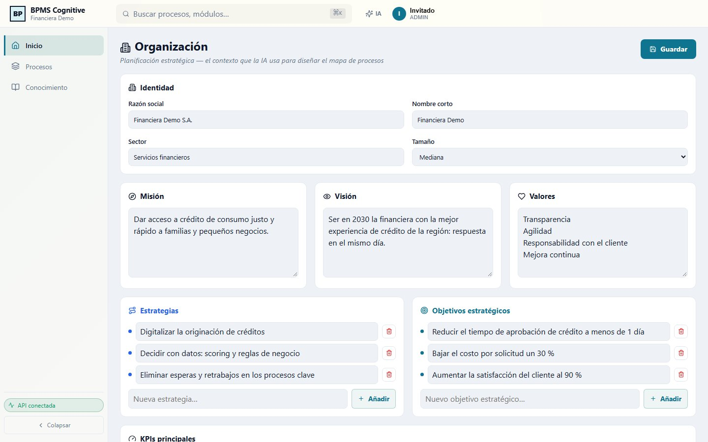

Es el **contexto estratégico** de la organización. La IA lo tiene en cuenta cuando le preguntas
por estrategia, objetivos o el mapa de procesos.

| Bloque | Qué poner |
|---|---|
| **Identidad** | Razón social, nombre corto (aparece bajo el logo), sector y tamaño |
| **Misión / Visión / Valores** | Texto libre; valores, uno por línea |
| **Estrategias** y **Objetivos estratégicos** | Escribe y pulsa **Añadir** (o `Enter`); edita en la propia línea; 🗑 para borrar |

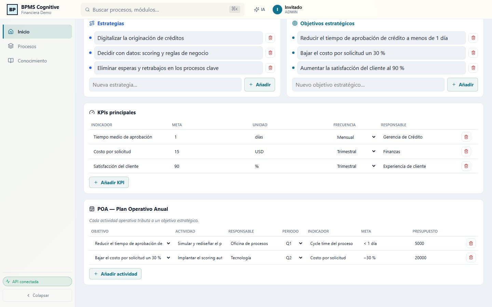

| Bloque | Columnas |
|---|---|
| **KPIs principales** | Indicador · Meta · Unidad · Frecuencia · Responsable. **Añadir KPI** crea una fila. |
| **POA — Plan Operativo Anual** | Objetivo (se elige entre los objetivos estratégicos) · Actividad · Responsable · Periodo · Indicador · Meta · Presupuesto. |

> 💾 Los cambios de esta pantalla **solo se guardan al pulsar «Guardar»** (arriba a la derecha).
> Aparece «Guardado hh:mm:ss» cuando el servidor los ha recibido.

---

## 4. Procesos → Mapa de procesos

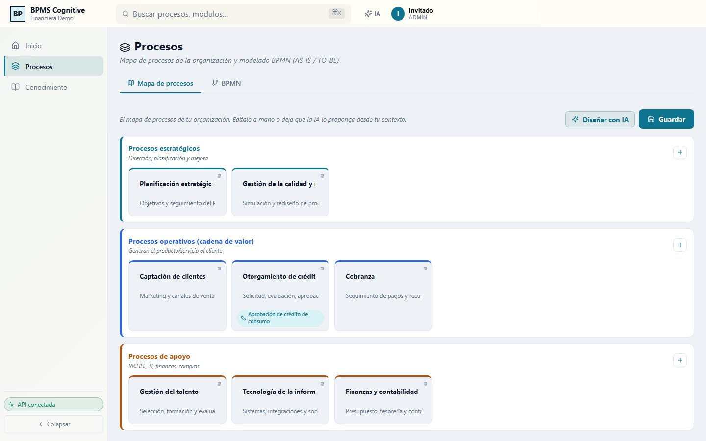

El mapa clasifica los procesos en tres bandas (estilo ISO 9001):

- **Estratégicos**: dirección, planificación y mejora.
- **Operativos (cadena de valor)**: generan el producto o servicio para el cliente.
- **De apoyo**: RR. HH., TI, finanzas, compras…

Cómo usarlo:

1. **+** a la derecha de una banda añade un proceso. Escribe el nombre y una descripción directamente
   en la tarjeta; 🗑 lo elimina.
2. **Diseñar con IA** propone un mapa base: dos procesos estratégicos y, si la organización tiene
   una cadena de valor registrada, sus actividades primarias y de apoyo. Revísalo y ajústalo.
3. Pulsa **Guardar**.

Los diagramas BPMN que pertenecen a un proceso aparecen como etiquetas dentro de su tarjeta (en la
captura, *Aprobación de crédito de consumo* dentro de *Otorgamiento de crédito*).

---

## 5. Procesos → BPMN (AS-IS / TO-BE)

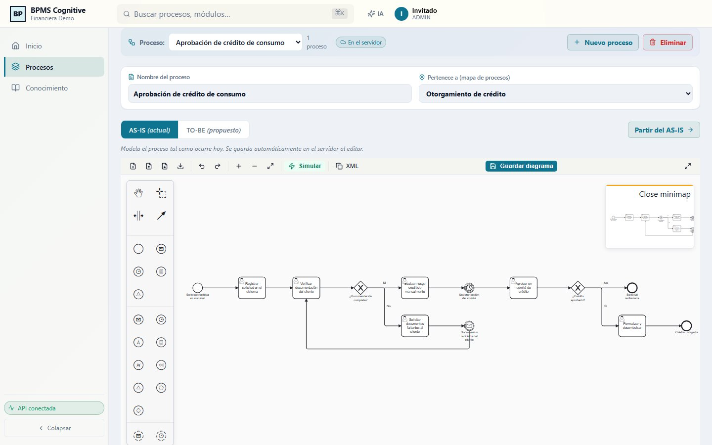

### Barra de procesos e identidad

| Control | Función |
|---|---|
| **Proceso** | Elige qué proceso editar. Cada proceso tiene su AS-IS y su TO-BE. |
| **Nuevo proceso** / **Eliminar** | Crea un proceso vacío / borra el proceso y sus dos diagramas (pide confirmación). |
| **En el servidor** · **Guardando…** · **Solo local** | Estado del guardado. «Solo local» significa que el backend no responde y el diagrama está únicamente en el navegador: expórtalo a `.bpmn`. |
| **Nombre del proceso** | Aparece en el mapa, en los informes de la IA y en los Excel. |
| **Pertenece a (mapa de procesos)** | Ubica el proceso en una tarjeta del mapa. |
| **AS-IS (actual)** / **TO-BE (propuesto)** | Cambia de escenario. |
| **Partir del AS-IS** | Copia el AS-IS en el TO-BE como punto de partida. ⚠ **Sustituye** el TO-BE que hubiera. |

### Barra de herramientas del editor

| Icono | Acción |
|---|---|
| 📄 | Nuevo diagrama en blanco |
| ⬆ | **Importar** un archivo `.bpmn` / `.xml` (si no trae coordenadas, se ordena solo) |
| ⬇ | **Descargar** como `.bpmn`: la copia de seguridad fuera de la aplicación |
| ⤓ | Descargar como imagen SVG |
| ↶ ↷ | Deshacer / rehacer (`Ctrl + Z` / `Ctrl + Y`) |
| ＋ − ⤢ | Acercar, alejar y **ajustar la vista** al diagrama |
| ⚡ **Simular** | Abre el [simulador](#6-simulador-introducir-los-datos) a la derecha |
| **XML** | Copia el XML del diagrama al portapapeles |
| **Guardar diagrama** | Guarda ya (el editor también guarda solo cada vez que cambias algo) |
| ⛶ | Pantalla completa (`Esc` para salir): muy recomendable para simular |

### Modelar

Arrastra elementos desde la **paleta** de la izquierda (eventos, tareas, compuertas, subprocesos…)
y únelos con flechas. Al seleccionar un elemento aparece su menú contextual para añadir el siguiente
paso, cambiar su tipo, colorearlo o borrarlo. Haz doble clic para escribir el nombre.

Buenas prácticas que el simulador aprovecha:

- Un **evento de inicio** y al menos un **evento de fin** conectados a todo el flujo.
- **Tareas** con verbo + objeto: «Verificar documentación del cliente».
- **Compuertas** como pregunta («¿Documentación completa?») y **ramas con nombre** («Sí» / «No»).
- **Eventos intermedios** para las esperas que no son trabajo: la sesión semanal del comité, la
  respuesta del cliente…
- Tipos de tarea con significado: *de usuario* (una persona), *de servicio*, *de reglas de negocio*,
  *de envío*… Las de sistema se tratan como automatizadas en el análisis.

### Cargar el ejemplo del manual

1. **Procesos → BPMN**, escribe el nombre *Aprobación de crédito de consumo* y ubícalo en el mapa.
2. En **AS-IS**, pulsa ⬆ **Importar** y elige `docs/ejemplos/credito-asis.bpmn`.
3. Cambia a **TO-BE**, pulsa ⬆ **Importar** y elige `docs/ejemplos/credito-tobe.bpmn`.

---

## 6. Simulador: introducir los datos

El simulador ejecuta el diagrama **muchas veces**, como si llegaran solicitudes reales, y mide
tiempos, colas, costos y ocupación. Un **token** (punto de color) es **una solicitud** recorriendo
el proceso.

Lo que el simulador necesita saber, en el orden en que conviene rellenarlo:

| # | Dato | Pregunta que responde |
|---|---|---|
| 1 | **Escenario** | ¿Cuántas solicitudes simulo y cada cuánto llegan? |
| 2 | **Recursos** | ¿Quién hace el trabajo, cuántas personas son y cuánto cuesta su hora? |
| 3 | **Horarios o turnos** | ¿Cuándo trabajan? |
| 4 | **Tareas** | ¿Cuánto dura cada tarea y quién la hace? |
| 5 | **Compuertas** | ¿Qué porcentaje de casos va por cada rama? |
| 6 | **Eventos** | ¿Cuánto duran las esperas? |

### 6.1 Abrir el simulador

Pulsa ⛶ (pantalla completa) y después ⚡ **Simular**.

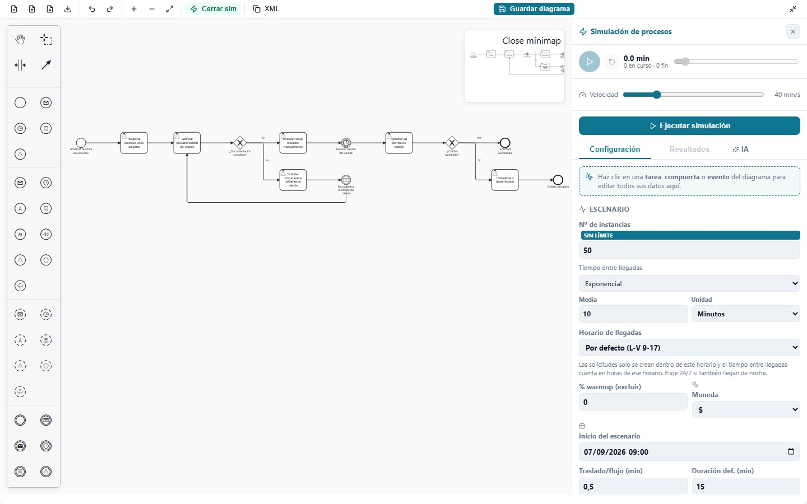

El panel tiene tres pestañas: **Configuración** (los datos), **Resultados** (se activa tras la
primera ejecución) e **IA** (el asistente). Arriba están los controles de la animación y el botón
**Ejecutar simulación**.

> 👆 **La forma más rápida de introducir datos es hacer clic en el propio diagrama**: al pulsar una
> tarea, compuerta o evento se abre su editor en la parte superior del panel. También puedes
> elegirlo en las listas de *Tareas*, *Compuertas* y *Eventos* del final del panel.

### 6.2 Pedir ayuda a la IA antes de empezar

En la pestaña **IA**, **«Ayúdame a llenar los datos»** lee tu diagrama y explica qué significa cada
dato, con **valores orientativos para cada tarea, compuerta y evento** según su nombre.

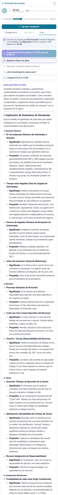

> Son **sugerencias** para empezar. Sustitúyelas por datos reales en cuanto los tengas (ver
> [6.10](#610-de-dónde-sacar-los-datos-reales)).

### 6.3 Escenario

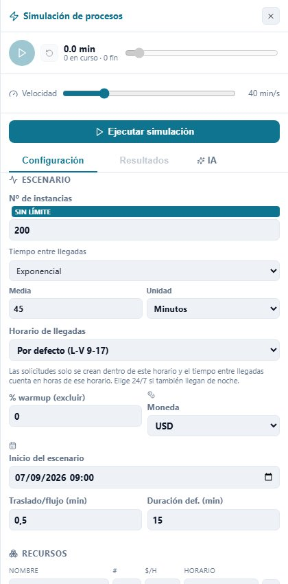

| Campo | Qué es | Cómo llenarlo | Ejemplo |
|---|---|---|---|
| **Nº de instancias** | Cuántas solicitudes se simulan | Entre 100 y 500 los promedios ya son estables. Sin límite, pero por encima de 20 000 se pide confirmación: el cálculo corre en tu navegador. | 200 |
| **Tiempo entre llegadas** | Cada cuánto entra una solicitud nueva | **Exponencial** con la media observada. Si llegan *N* solicitudes en una jornada de *H* horas, la media es *H × 60 / N* minutos. | Exponencial, media 45 min (≈ 10 al día) |
| **Horario de llegadas** | Cuándo pueden llegar solicitudes | Solo se crean dentro de este horario y el tiempo entre llegadas se cuenta en horas de ese horario. Elige **24/7** si también llegan de noche o en fin de semana. | Por defecto (L-V 9-17) |
| **% warmup (excluir)** | Descarta de las estadísticas las primeras solicitudes terminadas | 0 normalmente. Usa 5–10 % si el proceso arranca «vacío» y quieres medir el régimen estable. | 0 |
| **Moneda** | Símbolo de los costos | Solo es visual. | USD |
| **Inicio del escenario** | Fecha y hora del primer instante simulado | Importa con horarios o turnos. Por defecto, el lunes de esta semana a las 9:00. | — |
| **Traslado/flujo (min)** | Tiempo que suma cada flecha recorrida | 0 si los traspasos son inmediatos. | 0,5 |
| **Duración def. (min)** | Duración con la que se precargan las tareas al abrir el panel | Solo un punto de partida: pon a cada tarea su duración real. | 15 |

### 6.4 Recursos

Un **recurso** es **quién ejecuta las tareas**: un rol, un equipo o una máquina. Existen porque la
capacidad es limitada: si hay 1 analista y llegan 3 solicitudes, 2 esperan. **Sin recurso no hay
colas ni costo por hora** (la tarea se hace al instante y a cualquier hora).

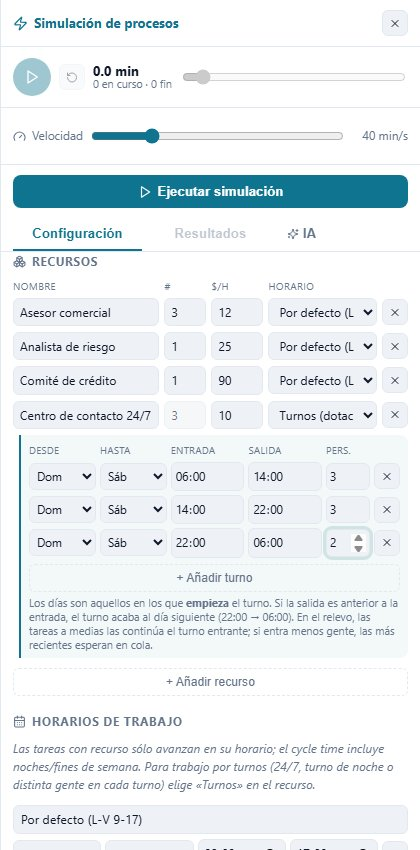

Pulsa **+ Añadir recurso** y rellena la fila:

| Columna | Qué es | Ejemplo |
|---|---|---|
| **Nombre** | El rol, tal como lo elegirás en cada tarea | Analista de riesgo |
| **#** | Personas que trabajan **en paralelo** | 1 |
| **$/H** | Costo de una hora de trabajo de **una** persona (sueldo + cargas ÷ horas productivas) | 25 |
| **Horario** | Cuándo trabaja: un horario de la lista o **Turnos (dotación variable)** | Por defecto (L-V 9-17) |

Recursos del ejemplo (AS-IS):

| Recurso | # | $/h | Horario |
|---|---|---|---|
| Asesor comercial | 3 | 12 | Por defecto (L-V 9-17) |
| Analista de riesgo | 1 | 25 | Por defecto (L-V 9-17) |
| Comité de crédito | 1 | 90 | Por defecto (L-V 9-17) |

> El comité se modela como **un** recurso porque decide en conjunto; su $/h es el costo de la sesión.

### 6.5 Horarios de trabajo

Vienen dos: **Por defecto (L-V 9-17)** y **24/7**. **+ Añadir horario** crea otro: nombre, día de
inicio y fin, y hora de apertura y cierre.

Efecto en la simulación:

- Una tarea con recurso **solo avanza dentro de su horario**. Si empieza a las 16:50 y dura 30 min,
  se **pausa a las 17:00 y termina a las 9:20** del día siguiente hábil.
- Por eso el resultado distingue la **espera** (cola en horas hábiles) de la **inactividad** (noches,
  fines de semana y tareas a medias).
- La hora de cierre debe ser posterior a la de apertura. Para trabajo que **cruza la medianoche**
  usa **Turnos** (siguiente apartado).

### 6.6 Turnos (24/7 y dotación variable)

Elige **Turnos (dotación variable)** en el horario del recurso cuando el número de personas
**cambia a lo largo del día** o el trabajo **cruza la medianoche**. Se precargan tres turnos de 8 h
(06–14, 14–22 y 22–06) que puedes editar:

| Columna | Qué es |
|---|---|
| **Desde / Hasta** | Días en los que **empieza** el turno (Dom … Sáb) |
| **Entrada / Salida** | Horas del turno. Si la salida es anterior a la entrada, el turno acaba al día siguiente (22:00 → 06:00). |
| **Pers.** | Personas en ese turno |

La columna **#** del recurso queda bloqueada: muestra el turno con más personas. Hay un ejemplo
completo en [11. Procesos 24/7 con turnos](#11-procesos-247-con-turnos).

### 6.7 Tareas

Haz clic en la tarea del diagrama:

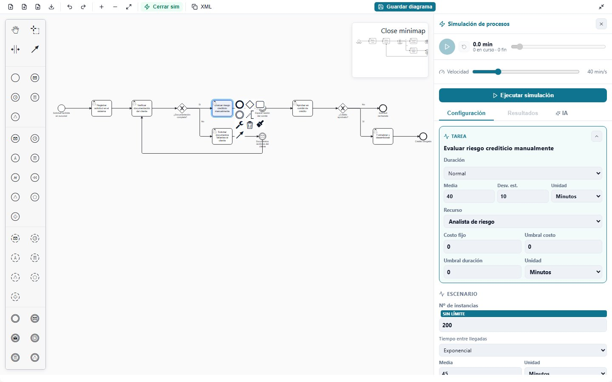

| Campo | Qué es | Cuándo llenarlo |
|---|---|---|
| **Duración** | Tiempo de **trabajo efectivo**: distribución, parámetros y unidad | Siempre: es el dato más importante |
| **Recurso** | Quién la hace. «Sin recurso (24/7)» = sin cola, sin costo por hora y sin horario | Siempre que la haga una persona o un equipo limitado |
| **Costo fijo** | Costo por ejecución, además del recurso (comisiones, materiales, llamadas a APIs…) | Si existe |
| **Umbral costo** | Cuenta cuántas ejecuciones cuestan más que esto | Opcional (control de costos) |
| **Umbral duración** + unidad | Cuenta cuántas ejecuciones duran más que esto | Opcional (SLA, p. ej. «no más de 2 h») |

**Qué distribución elegir**

| Distribución | Úsala cuando… | Parámetros |
|---|---|---|
| **Fija** | Siempre dura lo mismo (tareas automáticas) | Media |
| **Exponencial** | Llegadas aleatorias; muchos valores cortos y pocos muy largos | Media |
| **Normal** | Tiempos simétricos alrededor de un promedio | Media, Desv. est. |
| **Uniforme** | Solo conoces un rango y cualquier valor es igual de probable | Mín, Máx |
| **Triangular** | Tienes una estimación de mínimo, **más probable** y máximo (entrevistas) | Mín, Moda, Máx |
| **Log-Normal** | Duraciones reales de trabajo humano: sesgadas, con una cola larga | Media, Desv. est. |
| **Gamma** | Tiempos de servicio acumulados, también sesgados | Media, Desv. est. |

Tareas del ejemplo (AS-IS):

| Tarea | Duración | Recurso |
|---|---|---|
| Registrar solicitud en el sistema | Normal 20 ± 5 min | Asesor comercial |
| Verificar documentación del cliente | Normal 30 ± 8 min | Asesor comercial |
| Solicitar documentos faltantes al cliente | Normal 10 ± 3 min | Asesor comercial |
| Evaluar riesgo crediticio manualmente | Normal 40 ± 10 min | Analista de riesgo |
| Aprobar en comité de crédito | Normal 30 ± 5 min | Comité de crédito |
| Formalizar y desembolsar | Normal 45 ± 10 min | Asesor comercial |

### 6.8 Compuertas

Haz clic en la compuerta y escribe la **probabilidad de cada rama** (de 0 a 1):

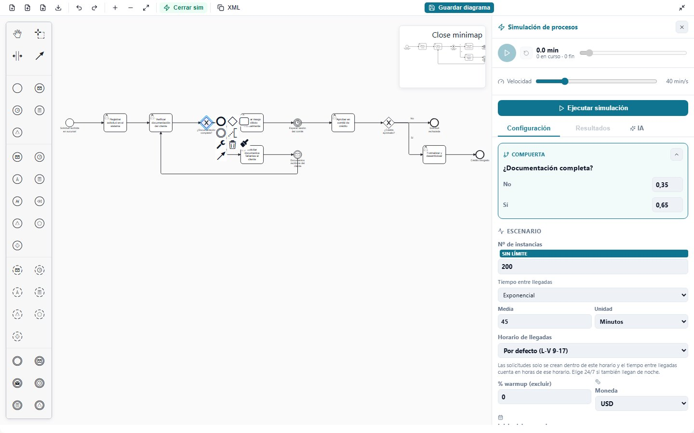

| Tipo | Cómo se usan las probabilidades |
|---|---|
| **Exclusiva (X)** | La solicitud toma **una** rama. Las probabilidades deben **sumar 1**. |
| **Inclusiva (O)** | Cada rama se activa **por separado** con su probabilidad (siempre al menos una). La compuerta que las une espera a las ramas que se abrieron. |
| **Paralela (+)** | Se recorren **todas** las ramas: no lleva datos. La compuerta que las une espera a todas. |

Las ramas se identifican por su nombre («Sí», «No») o por la tarea a la que llevan. Si el nombre de
una rama es un número («0.35»), se usa como probabilidad inicial.

Ejemplo: **¿Documentación completa?** → No 0,35 · Sí 0,65; **¿Crédito aprobado?** → Sí 0,7 · No 0,3.

### 6.9 Eventos de espera y eventos de borde

**Eventos intermedios** (reloj, mensaje…): una **demora** con distribución y unidad. Es **tiempo de
calendario**: 3 días son 72 horas, con noches y fines de semana incluidos. Con demora 0 la solicitud
pasa sin detenerse.

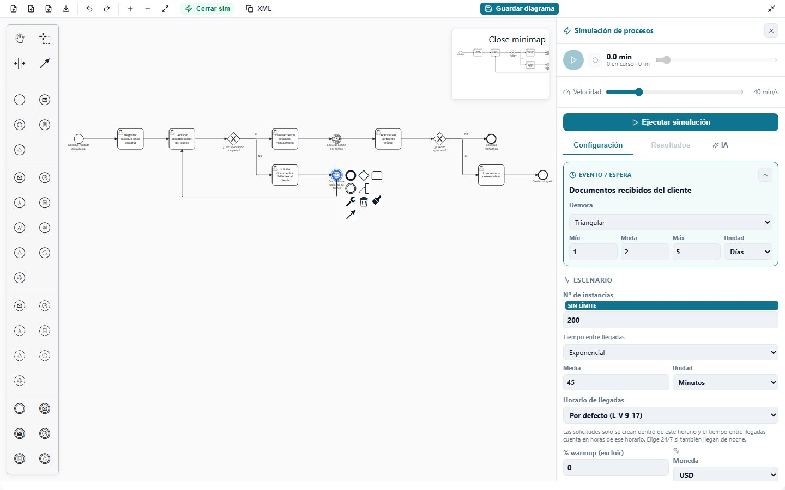

Eventos del ejemplo:

| Evento | Demora | Por qué |
|---|---|---|
| Documentos recibidos del cliente | Triangular 1 / 2 / 5 días | El cliente suele tardar 2 días, como mínimo 1 y hasta 5 |
| Esperar sesión del comité | Fija 3 días | El comité se reúne una vez por semana |

**Eventos de borde** (pegados al borde de una tarea: temporizador, error, escalación…): solo llevan
una **duración**. Funcionan como una **carrera** desde que empieza el trabajo:

- Si el evento llega **antes** de que la tarea termine y es **interruptor** (borde continuo), cancela
  la tarea y la solicitud sale por la rama del evento.
- Si es **no interruptor** (borde discontinuo), la tarea sigue y además se abre una rama paralela.
- Duración 0 = nunca se dispara.

### 6.10 De dónde sacar los datos reales

| Dato | Fuente recomendada | Consejo de analista |
|---|---|---|
| Llegadas | Registros del sistema (fecha y hora de alta) de 4 a 8 semanas | Cuenta llegadas por hora hábil; si hay picos por día u hora, simula el periodo pico por separado |
| Duraciones | Marcas de tiempo inicio/fin; si no hay, cronometraje (≥ 30 observaciones) | Mide **trabajo efectivo**, no el tiempo entre que llega y sale (eso ya lo calcula el simulador) |
| Estimaciones de expertos | Entrevistas: mínimo, más probable y máximo | Úsalas con la **triangular** |
| Probabilidades | Porcentaje histórico de cada decisión | Revisa que las de cada compuerta exclusiva sumen 1 |
| Personas y horarios | Planillas y cuadrantes de turnos | Cuenta a quienes **realmente** hacen la tarea |
| Costo por hora | (Sueldo + cargas sociales) ÷ horas productivas al mes | Suma licencias o equipos si son por hora |
| Validación | Compara el cycle time simulado del AS-IS con el real | Si difieren más de un 10–15 %, revisa llegadas, duraciones y esperas antes de proponer mejoras |

---

## 7. Ejecutar y leer los resultados

Pulsa **Ejecutar simulación**. Los tokens recorren el diagrama y las tareas activas se resaltan.
Con ▶ / ⏸ pausas la animación, ↺ la reinicia, la barra la desplaza en el tiempo y **Velocidad**
fija cuántos minutos simulados pasan por segundo.

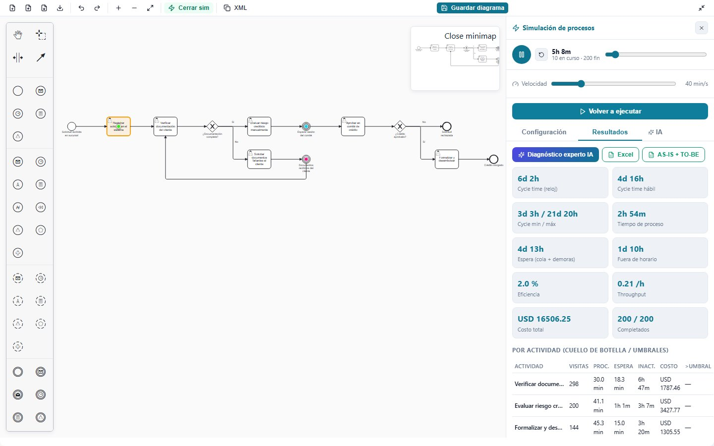

> Con los mismos datos, **los resultados son siempre los mismos** (semilla fija). Si cambias un
> dato, la diferencia se debe a ese cambio y no al azar.

### 7.1 Indicadores

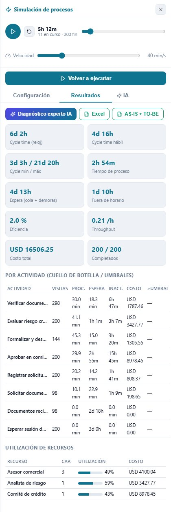

| Indicador | Qué significa | AS-IS del ejemplo |
|---|---|---|
| **Cycle time (reloj)** | Tiempo medio de calendario de una solicitud, de inicio a fin | **6d 2h** |
| **Cycle time hábil** | Solo trabajo, espera hábil, demoras y traslados (sin noches ni fines de semana parados) | 4d 16h |
| **Cycle min / máx** | La solicitud más rápida y la más lenta | 3d 3h / 21d 20h |
| **Tiempo de proceso** | Trabajo efectivo medio por solicitud | 2h 54m |
| **Espera (cola + demoras)** | Cola por recursos ocupados (en horas hábiles) + demoras de los eventos | 4d 13h |
| **Fuera de horario** | Tiempo parado porque el recurso no trabajaba: noches, fines de semana, tareas a medias | 1d 10h |
| **Eficiencia** | Tiempo de proceso ÷ cycle time. Bajo = la solicitud pasa casi todo el tiempo esperando | **2,0 %** |
| **Throughput** | Solicitudes terminadas por hora de calendario | 0,21 /h |
| **Costo total** | Horas de recurso × $/h + costos fijos | USD 16 506,25 (USD 82,53 por solicitud) |
| **Completados** | Solicitudes que llegaron a un evento de fin / iniciadas | 200 / 200 |

Cómo leerlos en conjunto:

- **Eficiencia baja** (< 25 %): el problema no es cuánto tarda el trabajo, sino **cuánto espera**. En
  el ejemplo, de 6 días solo 2 h 54 min son trabajo.
- **Espera ≫ proceso**: busca en la tabla qué actividad acumula la espera (cola o demora).
- **Fuera de horario alto**: el horario frena el proceso (tareas que no caben en la jornada, llegadas
  al final del día). Se ataca con turnos, horarios extendidos o automatización.
- **Completados < iniciados**: parte de las solicitudes no terminó dentro del horizonte simulado
  (proceso saturado o bucle sin salida).

### 7.2 Tabla por actividad

| Columna | Significado |
|---|---|
| **Visitas** | Ejecuciones. Más visitas que solicitudes = **retrabajo** (en el ejemplo, *Verificar documentación* 298 veces para 200 solicitudes) |
| **Proc.** | Trabajo medio por ejecución |
| **Espera** | Cola media por ejecución; en los eventos, su demora (*Esperar sesión del comité*: 3d 0h) |
| **Inact.** | Tiempo medio fuera de horario por ejecución |
| **Costo** | Costo acumulado de la actividad |
| **>umbral** | Ejecuciones que superan el umbral de duración (`d`) y de costo (`c`) |

### 7.3 Utilización de recursos

**Utilización = trabajo realizado ÷ personas-minuto disponibles** en su horario durante el periodo
simulado. En el ejemplo: Asesor comercial 49 %, Analista de riesgo 59 %, Comité de crédito 43 %.

- **> 85 %**: recurso saturado; cualquier pico se convierte en cola.
- **< 30 %**: capacidad ociosa o mal repartida.
- Con turnos, la capacidad se muestra como «≤ N» (el turno más numeroso).

### 7.4 Avisos

Aparecen en amarillo sobre los indicadores: horarios mal definidos, recursos con turnos sin personas,
solicitudes que repiten demasiados pasos (bucle sin salida), diagramas sin evento de fin…

### 7.5 Exportar a Excel

- **Excel**: indicadores, tabla por actividad y recursos del escenario actual.
- **AS-IS + TO-BE**: una hoja de **comparación** con la diferencia de cada indicador y una hoja por
  escenario. Ejecuta antes los dos.

---

## 8. Interpretar el AS-IS con la IA

### 8.1 Qué hace cada acción de la pestaña IA

| Acción | Cuándo usarla | Qué entrega |
|---|---|---|
| **Diagnosticar AS-IS y diseñar el TO-BE** ⭐ | Tras simular el AS-IS | Diagnóstico, cuellos de botella, desperdicios, qué mejorar, diseño del TO-BE e **impacto re-simulado**. Queda guardado para consultarlo desde el TO-BE. |
| **Ayúdame a llenar los datos** | Antes de simular | Qué significa cada dato y valores orientativos por elemento |
| **Interpretar resultados** | Tras simular | Lectura de los indicadores y qué mejorar |
| **¿Qué metodología de mejora usar?** | Tras simular | Lean, Six Sigma (DMAIC), Teoría de Restricciones o automatización, según los hallazgos, con próximos pasos |
| **Comparar AS-IS vs TO-BE** | Con los dos escenarios simulados | Tabla de diferencias y qué mejoró o empeoró |

El botón **Diagnóstico experto IA** de la pestaña *Resultados* es un atajo a la primera acción.

### 8.2 De dónde salen las cifras: cálculo + redacción

El asistente **no inventa números**. Primero, el propio simulador:

1. **Detecta los hallazgos** con reglas de analista (tabla 8.4).
2. **Mide cada mejora posible re-simulando** el mismo escenario con el cambio aplicado: misma
   semilla y mismas llegadas, así que la diferencia se debe solo a ese cambio.

Después, si hay un modelo de lenguaje configurado, este **redacta** el informe con esas cifras
delante. Si no lo hay (o falla), ves directamente el análisis calculado con la etiqueta
**«Calculado por el simulador»**.

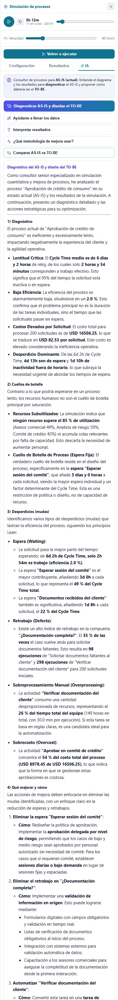

Debajo de cada respuesta del modelo está el desplegable **«Cifras calculadas por el simulador»**:
ábrelo para comprobar que el texto cita los números correctos.

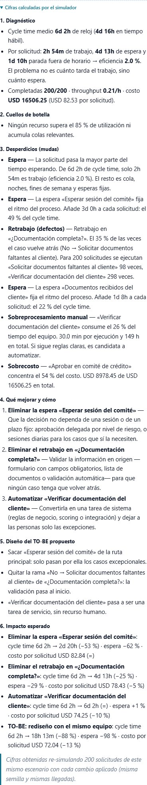

> El texto del modelo cambia un poco en cada consulta; **las cifras calculadas no**.

### 8.3 Cómo leer el diagnóstico (ejemplo del crédito)

| Sección | Qué buscar | En el ejemplo |
|---|---|---|
| **1. Diagnóstico** | Cycle time, trabajo, espera, eficiencia y costo por solicitud | 6d 2h de cycle time con 2h 54m de trabajo: **eficiencia 2,0 %**; USD 82,53 por solicitud |
| **2. Cuellos de botella** | Recursos > 85 % o colas relevantes | Ninguno: **no falta gente**, el problema son las esperas |
| **3. Desperdicios (mudas)** | Esperas, retrabajo, sobreprocesamiento, sobrecosto | Sesión del comité: **3 días (49 % del cycle)**; documentos del cliente: 1d 8h por solicitud (22 %); **retrabajo del 35 %**; *Verificar documentación* consume el 26 % del tiempo del equipo; el comité concentra el **54 % del costo** |
| **4. Qué mejorar y cómo** | Acciones concretas, por orden de impacto | Quitar la espera del comité (aprobación delegada por riesgo), validar en origen, automatizar la verificación |
| **5. Diseño del TO-BE** | Qué cambia en el diagrama | El comité solo para casos excepcionales; sin rama de retrabajo; verificación como tarea de servicio |
| **6. Impacto esperado** | Cifras re-simuladas de cada cambio | Ver tabla siguiente |

Impacto re-simulado de cada palanca (200 solicitudes):

| Cambio | Cycle time | Espera | Costo por solicitud |
|---|---|---|---|
| Eliminar la espera del comité | 6d 2h → 2d 20h (**−53 %**) | −62 % | USD 82,84 (=) |
| Eliminar el retrabajo | 6d 2h → 4d 13h (−25 %) | −29 % | USD 78,43 (−5 %) |
| Automatizar la verificación | 6d 2h → 6d 2h (=) | +1 % | USD 74,25 (−10 %) |
| **Rediseño combinado, mismo equipo** | 6d 2h → **18h 13m (−88 %)** | −98 % | USD 72,04 (−13 %) |

**Conclusión del analista**: automatizar por sí solo apenas acorta el proceso; lo que manda son la
**espera del comité** y el **retrabajo**. El rediseño que ataca los tres puntos a la vez reduce el
cycle time un 88 % sin contratar a nadie.

### 8.4 Hallazgos que detecta el análisis

| Hallazgo | Se señala cuando… | Severidad alta si… |
|---|---|---|
| Baja eficiencia | trabajo ÷ cycle time < 25 % | < 10 % |
| Espera fija | la demora de un evento por solicitud ≥ 15 % del cycle time | ≥ 40 % |
| Horario laboral | el tiempo fuera de horario ≥ 30 % del cycle time | ≥ 50 % |
| Retrabajo | una rama de compuerta exclusiva devuelve el caso a un paso anterior | su probabilidad ≥ 20 % |
| Recurso saturado | utilización ≥ 85 % | ≥ 95 % |
| Cuello de botella | la cola media de una tarea ≥ 5 % del cycle time | ≥ 25 % |
| Trabajo manual | una tarea manual consume ≥ 15 % del tiempo del equipo (solo si hay esperas, colas o saturación) | ≥ 35 % |
| Concentración del costo | una actividad ≥ 40 % del costo total (con 3 o más actividades con costo) | — |

### 8.5 Palancas que se re-simulan

| Palanca | Cambio que se simula |
|---|---|
| Quitar la espera | Se elimina la demora del evento con más peso |
| Eliminar el retrabajo | Probabilidad 0 para la rama que vuelve atrás (la más frecuente) |
| Automatizar | La tarea manual con más horas pasa a 2 min fijos, sin recurso |
| Reforzar capacidad | Una persona más en el recurso más saturado (**una más por turno** si trabaja por turnos). Su sueldo no está en el costo simulado: el informe lo estima aparte. |
| Rediseño combinado | Todas las anteriores salvo contratar |

Las re-simulaciones usan como máximo 3 000 solicitudes para no bloquear el navegador.

---

## 9. Diseñar y simular el TO-BE

### 9.1 Modelar el TO-BE

En **BPMN → TO-BE**, parte del AS-IS (**Partir del AS-IS**) o importa un diagrama, y aplica los
cambios de la sección *5. Diseño del TO-BE* del diagnóstico.

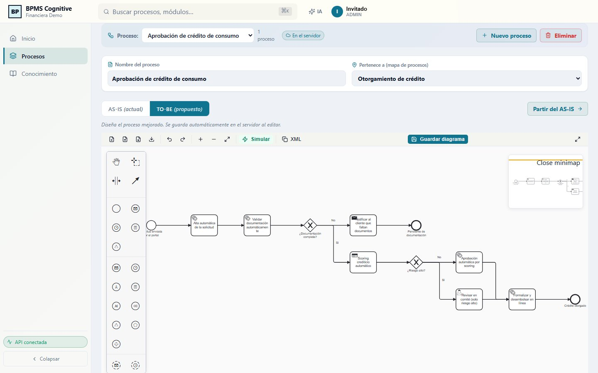

Cambios del ejemplo: solicitud por portal con **alta automática**, **validación documental
automática** (sin bucle: si falta algo se notifica al cliente y la solicitud queda pendiente),
**scoring automático** y **comité solo para el 25 % de alto riesgo**.

### 9.2 Consultar la propuesta mientras configuras

En el simulador del TO-BE, pestaña **IA** → **«Propuesta que salió del AS-IS»** muestra el diagnóstico
guardado, sin volver a la otra pestaña.

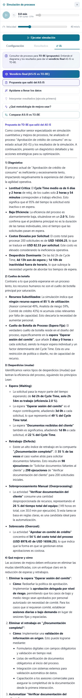

### 9.3 Datos del TO-BE

> ⚖️ **Usa la misma demanda que en el AS-IS** (instancias, tiempo entre llegadas y horario de
> llegadas). Si cambias la demanda, la comparación ya no mide el rediseño.

| Elemento | Datos del ejemplo |
|---|---|
| Escenario | 200 instancias · Exponencial 45 min · L-V 9-17 · USD |
| Recurso | Comité de crédito · 1 · 90 $/h · L-V 9-17 |
| Tareas automáticas | Fija 1–2 min, sin recurso. *Validar documentación*: costo fijo USD 0,30; *Scoring*: USD 0,50 por consulta |
| Revisar en comité (solo riesgo alto) | Normal 30 ± 5 min · Comité de crédito |
| Formalizar y desembolsar en línea | Fija 5 min, sin recurso |
| ¿Documentación completa? | No 0,1 · Sí 0,9 |
| ¿Riesgo alto? | Sí 0,25 · No 0,75 |

### 9.4 Resultados del TO-BE

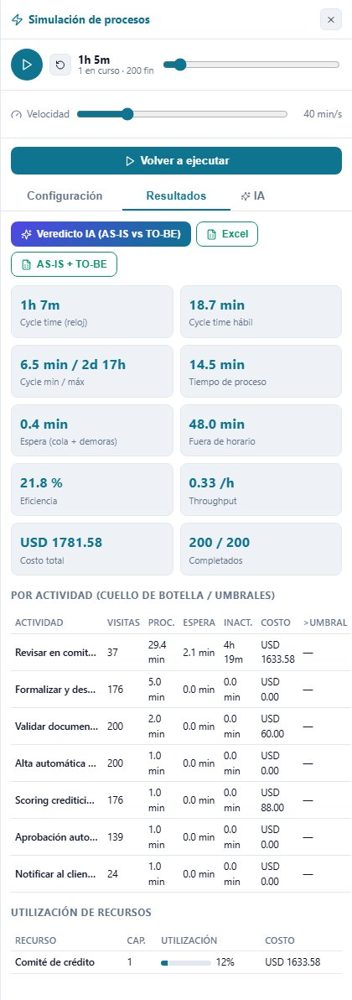

| Indicador | AS-IS | TO-BE |
|---|---|---|
| Cycle time (reloj) | 6d 2h | **1h 7m** |
| Cycle time hábil | 4d 16h | 18,7 min |
| Tiempo de proceso | 2h 54m | 14,5 min |
| Espera (cola + demoras) | 4d 13h | 0,4 min |
| Fuera de horario | 1d 10h | 48,0 min |
| Eficiencia | 2,0 % | 21,8 % |
| Throughput | 0,21 /h | 0,33 /h |
| Costo total | USD 16 506,25 | USD 1 781,58 |
| Costo por solicitud | USD 82,53 | USD 8,91 |
| Utilización máxima | 59 % | 12 % |

Lectura crítica, como la haría un analista:

- El **máximo de 2d 17h** corresponde a solicitudes de alto riesgo que llegan cuando el comité ya no
  trabaja (viernes por la tarde): el horario del comité sigue siendo la restricción de ese 25 %.
- **24 solicitudes terminan en «Pendiente de documentación»**: cuentan como completadas, pero no son
  créditos otorgados. Si el cliente vuelve a presentarlas, entran como solicitudes nuevas.
- El comité queda al **12 %**: hay margen para absorber más demanda o reasignar tiempo.

---

## 10. Veredicto: AS-IS vs TO-BE

Con los dos escenarios simulados, en la pestaña **IA** del TO-BE pulsa **«Veredicto final (AS-IS vs
TO-BE)»** (o **Veredicto IA** en *Resultados*).

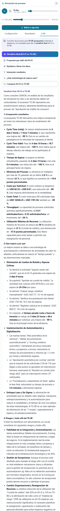

El veredicto tiene cuatro partes:

1. **Comparación cuantitativa**: cycle time, cycle hábil, trabajo, espera, fuera de horario,
   eficiencia, costo por solicitud y total, throughput, utilización máxima y completadas, con el cambio
   de cada uno.
2. **Qué mejoró y por qué**: si la mejora viene del **tiempo parado** (cola y fuera de horario) o del
   **trabajo**, qué actividades desaparecieron o son nuevas.
3. **Riesgos y trade-offs**.
4. **Veredicto final**.

### Reglas de decisión del veredicto calculado

| Condición | Umbral |
|---|---|
| **Mejora** | el cycle time **o** el costo por solicitud bajan al menos un **10 %** |
| **Empeora** | el cycle time **o** el costo por solicitud suben al menos un **5 %** |
| **Riesgos** | un recurso del TO-BE ≥ 90 % · terminan proporcionalmente menos solicitudes (> 2 puntos) · el throughput cae ≥ 5 % · el cycle time o el costo por solicitud suben ≥ 5 % |

| Decisión | Cuándo |
|---|---|
| ✅ **Se implementa el TO-BE** | Mejora, no empeora nada y no hay riesgos |
| ⚠️ **Se implementa con ajustes** | Mejora, pero hay riesgos o algún indicador empeora |
| ❌ **No se implementa tal como está** | No mejora lo suficiente, o empeoran a la vez cycle time y costo |

**En el ejemplo**: cycle time **−99 %** (6d 2h → 1h 7m) y costo por solicitud **−89 %**
(USD 82,53 → 8,91), sin recursos al límite ni caída de solicitudes terminadas → **Se implementa el
TO-BE**, validando antes con un piloto que las integraciones automáticas tardan lo simulado.

---

## 11. Procesos 24/7 con turnos

Muchos procesos no paran: centros de contacto, hospitales, logística, monitoreo, producción. El
simulador los modela con **turnos por recurso**, con distinta dotación en cada uno.

### Ejemplo: mesa de atención 24/7 con tres jornadas de 8 horas

| Turno | Días | Entrada → Salida | Personas | Personas-hora/día |
|---|---|---|---|---|
| Mañana | Dom–Sáb | 06:00 → 14:00 | 3 | 24 |
| Tarde | Dom–Sáb | 14:00 → 22:00 | 3 | 24 |
| Noche | Dom–Sáb | 22:00 → 06:00 | 2 | 16 |
| **Total** | | | | **64** |

Cómo configurarlo:

1. **Recursos** → **+ Añadir recurso** → horario **Turnos (dotación variable)**.
2. Ajusta las personas de cada turno (captura de [6.4](#64-recursos): 3 / 3 / 2).
3. **Escenario → Horario de llegadas: 24/7**. ⚠️ Si lo dejas en L-V 9-17, las solicitudes solo
   llegarían en horario de oficina y los turnos de noche no tendrían trabajo.
4. Asigna el recurso a sus tareas y ejecuta.

Qué calcula el simulador:

- **Capacidad en cada instante** = personas de los turnos activos (si dos turnos se solapan, se suman).
- **Relevo**: en el cambio de turno, las tareas a medias las continúa el turno entrante. Si entra
  **menos** gente de la que está trabajando, las tareas **más recientes** se detienen y vuelven
  **al principio de la cola**, conservando el trabajo ya hecho.
- **Espera** = tiempo en cola mientras hay alguien en turno; **fuera de horario** = tiempo sin nadie
  en turno.
- **Utilización** = trabajo ÷ personas-minuto de los turnos (64 personas-hora por día en el ejemplo).
- **Días de los turnos**: son los días en que el turno **empieza**. «Lun–Vie 22:00 → 06:00» cubre
  desde la noche del lunes hasta la mañana del sábado.

Cómo dimensionar la dotación, paso a paso:

1. Simula con la dotación actual y mira la **espera** y la **utilización**.
2. Si un recurso supera el 85 % o hay cola, prueba **una persona más en el turno crítico** (casi
   siempre la noche o el pico de la mañana) y vuelve a ejecutar.
3. La palanca «Reforzar capacidad» del diagnóstico ya prueba **una persona más por turno** y estima el
   costo extra (personas-hora añadidas × $/h).
4. Quédate con la dotación mínima que mantiene la espera dentro del objetivo de servicio.

---

## 12. AI Workspace

El botón **IA** de la barra superior abre un **consultor experto del módulo en el que estás**:
estrategia en Inicio, arquitectura de procesos y BPMN en Procesos y gestión del conocimiento en
Conocimiento.

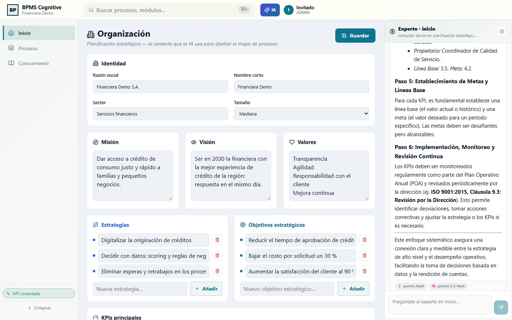

- Las **preguntas frecuentes** rellenan la caja de texto; `Enter` envía y `Shift + Enter` añade una
  línea.
- Bajo cada respuesta se ven el **proveedor** y el **modelo** que respondieron.
- El historial se guarda por módulo en tu navegador; ⊕ **Nueva conversación** lo borra (pide confirmación).
- Si falla, **Reintentar** repite la pregunta.

---

## 13. Conocimiento

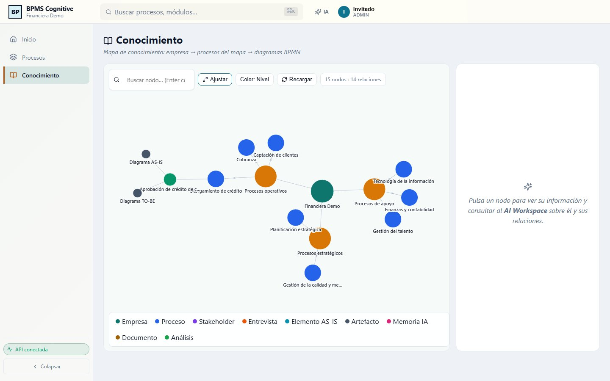

Grafo de la organización: la **empresa**, las **bandas** del mapa, sus **procesos** y los
**diagramas AS-IS / TO-BE** de cada uno.

| Control | Función |
|---|---|
| **Buscar nodo…** | Escribe parte del nombre; `Enter` centra el nodo |
| **Ajustar** | Encaja el grafo en la vista |
| **Color: Nivel / Área** | Cambia el criterio de color |
| **Recargar** | Vuelve a leer los datos |
| Clic en un nodo | Panel lateral con su información, **preguntas sugeridas** y una caja para preguntar; **🎯 Aislar subárbol** muestra solo sus ramas |

Las preguntas sobre un nodo las responde el **orquestador multiagente**: un planificador reparte la
consulta entre agentes especializados y un agente de síntesis integra la respuesta.

---

## 14. Búsqueda rápida (Ctrl + K)

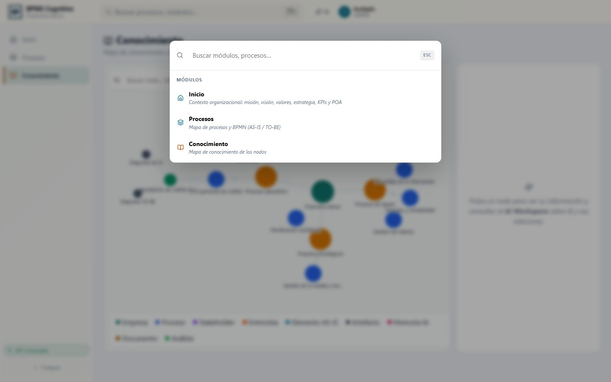

`Ctrl + K` (`⌘ K` en Mac) o el buscador de la barra superior abren la paleta: escribe para filtrar
los módulos (y los casos de proceso registrados) y pulsa un resultado para ir a él. `Esc` la cierra.

---

## 15. Cálculos del simulador

El simulador es un **motor de eventos discretos** que corre en el navegador
([`frontend/src/bpmn/sim`](../frontend/src/bpmn/sim)). Cada regla de este apartado está cubierta por
los tests automáticos del motor.

### 15.1 Cómo avanza

1. Se generan las **llegadas** de las *N* instancias.
2. Cada solicitud recorre el diagrama: las tareas **piden su recurso** (o hacen cola), trabajan
   durante una duración muestreada de su distribución, las compuertas eligen rama y los eventos esperan
   su demora.
3. Un reloj salta de evento en evento (llegadas, fines de tarea, cambios de turno…) hasta que no
   queda nada pendiente.
4. Con todo lo ocurrido se calculan los indicadores.

Los números aleatorios salen de un generador con **semilla fija (12345)**: los mismos datos dan
siempre los mismos resultados.

### 15.2 Llegadas

- Primera llegada: la primera apertura del **horario de llegadas** a partir del inicio del escenario.
- Siguientes: se suma una muestra del **tiempo entre llegadas**, contada **en minutos de ese horario**
  (con L-V 9-17, 45 min a las 16:40 caen el día hábil siguiente a las 9:25).
- Sin horario de llegadas, las llegadas son continuas 24/7.

### 15.3 Distribuciones

Todas las muestras se truncan en 0 (no hay duraciones negativas).

| Distribución | Muestra | Valor esperado |
|---|---|---|
| Fija | *media* | media |
| Exponencial | −media · ln(U) | media |
| Normal | media + desv · Z (Box-Muller) | media |
| Uniforme | mín + U · (máx − mín) | (mín + máx) / 2 |
| Triangular | inversa de la función de distribución con mín, moda y máx | (mín + moda + máx) / 3 |
| Log-Normal | exp(μ + σ · Z), con σ² = ln(1 + desv²/media²) y μ = ln(media) − σ²/2 | media |
| Gamma | forma k = media²/desv², escala θ = desv²/media | media |

*U* es uniforme en (0, 1) y *Z* normal estándar. Las demoras y eventos de borde cuyo valor esperado es
0 se ignoran.

### 15.4 Tareas con recurso

- **Cola FIFO** por recurso: la solicitud espera hasta que queda una persona libre.
- **Con horario**: el trabajo empieza en la siguiente apertura, se **pausa al cierre** y se retoma
  al abrir.
- **Espera** de la ejecución = minutos **hábiles** del recurso entre la llegada a la tarea y el inicio
  del trabajo.
- **Inactividad** = tiempo en la tarea − espera − trabajo (cierres antes de empezar y pausas).
- **Sin recurso**: empieza al llegar y dura exactamente la muestra, a cualquier hora.

### 15.5 Turnos

- Capacidad(t) = suma de personas de los turnos activos en el instante *t*.
- En cada cambio de capacidad: si baja, las tareas más recientes se detienen y vuelven al principio de
  la cola con su trabajo pendiente; si sube, se atienden las que esperan.
- Espera = tiempo en cola con capacidad > 0; inactividad = tiempo con capacidad 0.
- Si ningún turno tiene personas, se avisa y el recurso se simula con 1 persona 24/7.

### 15.6 Compuertas y eventos

| Elemento | Regla |
|---|---|
| Exclusiva | Una rama, elegida con probabilidad proporcional a su peso |
| Inclusiva | Cada rama con su probabilidad, de forma independiente (mínimo una); la unión espera a las ramas abiertas |
| Paralela | Todas las ramas; la unión espera a todas |
| Evento intermedio | Espera su demora en **tiempo de calendario**; cuenta como **espera** |
| Evento de borde | Carrera desde el inicio del trabajo: si llega antes del fin, interrumpe (o abre una rama paralela si es no interruptor); el trabajo cuenta hasta la interrupción |
| Instancia completada | Cuando termina su **última** rama; cuenta una sola vez aunque varias ramas lleguen a un fin |

### 15.7 Indicadores

Para cada solicitud *i* completada (tras descartar el warmup):

| Indicador | Fórmula |
|---|---|
| Cycle time (reloj) | fin_i − llegada_i |
| Tiempo de proceso | Σ trabajo de sus tareas |
| Espera | Σ esperas en cola (horas hábiles) + Σ demoras de eventos |
| Fuera de horario | Σ inactividad de sus tareas |
| Traslado | nº de flechas recorridas × traslado por flujo |
| Cycle time hábil | proceso + espera + traslado |
| **Eficiencia** | media(proceso) ÷ media(cycle time), máximo 100 % |
| **Throughput** | completadas ÷ horizonte × 60 (por hora; horizonte = instante del último evento) |

Cada indicador del panel es la **media** sobre las solicitudes completadas; mín y máx se toman sobre
las mismas solicitudes.

### 15.8 Costos

- Costo de una ejecución = trabajo (min) ÷ 60 × $/h del recurso + costo fijo de la tarea.
- **Costo total** = suma de todas las ejecuciones. **Costo por solicitud** = costo total ÷ completadas.
- Solo se paga el **trabajo**: esperas, noches y demoras no suman costo.

### 15.9 Utilización

- Personas-minuto disponibles = personas × minutos del horario dentro del horizonte (24/7 si no tiene
  horario), o la suma por turnos.
- **Utilización** = trabajo total del recurso ÷ personas-minuto disponibles (máximo 100 %).

### 15.10 Warmup

Con *w* % de warmup se descartan las primeras ⌊completadas × w / 100⌋ solicitudes **en orden de
finalización**, y **todos** los promedios se calculan sobre las restantes. El costo total y la
utilización incluyen todo el periodo.

### 15.11 Límites de seguridad

- Una solicitud que supera un número muy alto de pasos se detiene (bucle sin salida) y se avisa.
- Si se alcanza el tope de eventos, el resultado se marca como parcial.

---

## 16. Glosario

| Término | Significado |
|---|---|
| **AS-IS / TO-BE** | Proceso tal como es hoy / proceso rediseñado |
| **Instancia, solicitud, caso** | Una ejecución completa del proceso |
| **Token** | Representación visual de una instancia en la animación |
| **Recurso** | Rol o equipo con capacidad limitada que ejecuta tareas |
| **Horario / turno** | Cuándo trabaja un recurso / franja con su propia dotación |
| **Relevo** | Cambio de turno: el turno entrante continúa las tareas a medias |
| **Cola / espera** | Tiempo esperando a un recurso ocupado, o una demora |
| **Inactividad (fuera de horario)** | Tiempo parado porque el recurso no trabaja |
| **Cycle time** | Tiempo de principio a fin de una instancia |
| **Eficiencia de flujo** | Porcentaje del cycle time que es trabajo efectivo |
| **Throughput** | Instancias terminadas por unidad de tiempo |
| **Utilización** | Porcentaje de la capacidad disponible que se usó |
| **Warmup** | Periodo inicial que se excluye de las estadísticas |
| **Mudas** | Desperdicios según Lean: esperas, retrabajo, sobreprocesamiento… |
| **Palanca** | Cambio de mejora cuyo impacto se mide re-simulando |

---

## 17. Preguntas frecuentes

**¿Por qué el cycle time es mucho mayor que la suma de las duraciones?**
Porque incluye colas, esperas y el tiempo fuera de horario. En el ejemplo, 2h 54m de trabajo se
convierten en 6 días.

**¿La IA puede inventarse los resultados?**
Las cifras las calcula el simulador y viajan al modelo como fuente de verdad. Contrástalas siempre en
el desplegable «Cifras calculadas por el simulador». Sin modelo configurado, ves directamente ese
análisis.

**¿Necesito una API key?**
No. Sin clave tienes el análisis calculado completo; con clave (Gemini es gratuita), un modelo lo
redacta como un consultor. Ver [Configurar la IA](../README.md#-configurar-la-ia).

**¿Qué pasa si no asigno recurso a una tarea?**
Se ejecuta sin cola, sin horario y sin costo por hora (solo su costo fijo, si lo tiene). Úsalo para
tareas automáticas o de terceros.

**La utilización sale baja aunque la gente parece ocupada.**
Se mide sobre todas las horas disponibles del periodo simulado, incluidos los días finales en que ya
casi no llegan solicitudes. Compara escenarios con la misma demanda y el mismo número de instancias.

**¿Cómo modelo un proceso que trabaja 24 horas?**
Con **Turnos** en el recurso y el **horario de llegadas 24/7**: ver
[11. Procesos 24/7 con turnos](#11-procesos-247-con-turnos).

**¿Dónde se guardan los resultados de la simulación?**
En tu navegador. Los diagramas y los datos de la organización se guardan en el servidor.

**El AS-IS simulado no se parece al proceso real. ¿Qué reviso?**
Por orden: el tiempo entre llegadas y su horario, las duraciones (deben ser trabajo efectivo, no el
tiempo total), las demoras de los eventos y las personas y horarios de cada recurso. Calibra hasta
que el cycle time simulado esté a menos de un 10–15 % del real antes de proponer mejoras (ver
[6.10](#610-de-dónde-sacar-los-datos-reales)).
